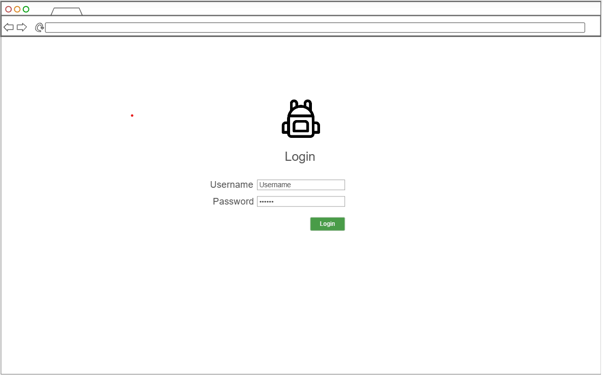
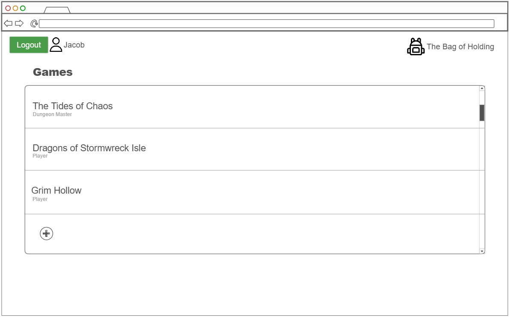
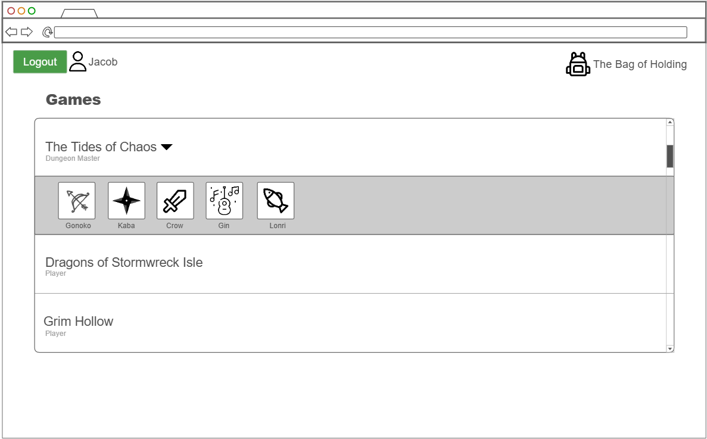
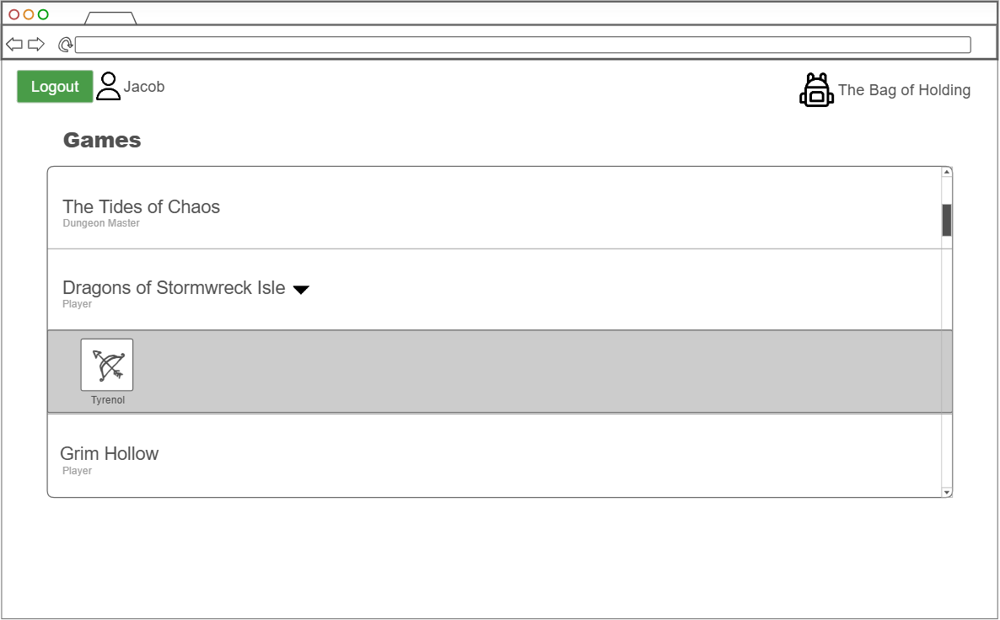
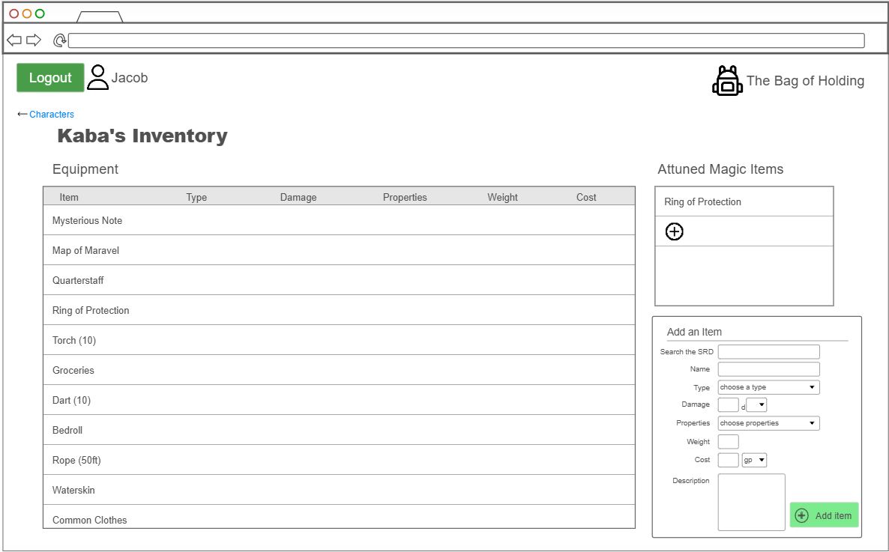
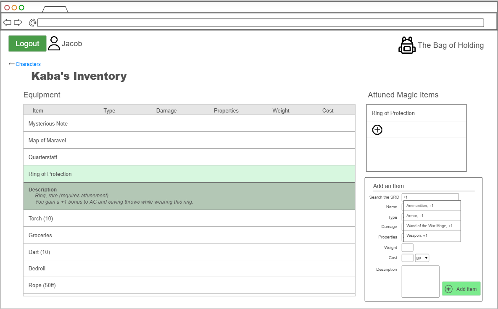

# The Bag of Holding

Welcome to The Bag of Holding!

## Elevator Pitch

The default DND character sheet is great for a lot of things, but tracking your character's inventory is not one of them. The tiny box at the bottom labeled "Equipment" will barely fit your inventory at level 1, and as you continue accumulating treasure, magic items, and tools, the problem will only get worse. *The Bag of Holding* is a great way for your whole party to keep track of the odds and ends you pick up.

## Key Features
- Create multiple characters with unique inventories
- Add and remove items from a character's inventory
- 5e SRD integration allows searching for and adding existing items

## Technologies Represented
- HTML - Three HTML pages: Login, Game+Character Select, and Inventory
- CSS - works on multiple devices with appropriate stylistic decisions
- JavaScript - menus are sortable based on user input. Users can click through the Game+Character Select menu to choose an inventory to modify. The Add Item button opens a searchable list of SRD content, with an option to create a custom item.
- React - will use the React web framework
- Service - Backend has endpoints for:
    - adding custom inventory items
    - retrieving inventory lists
    - retrieving 5e SRD items using https://www.dnd5eapi.co/api/equipment/item-name
- Authentication - users create accounts and log in. Creating a game assigns a user the role of DM, and they are given authentication to modify any inventory in that game. Non-DMs can only modify inventories of their own characters.
- Database - store users, games, characters, and lists of inventory items
- WebSocket - A DM modifying a player's inventory will send a notification to the player
    

## Sketches

### Login Screen

### Character Selection

### Inventory

## HTML Deliverable
For this deliverable, I added general structure to my website and made "rough draft" decisions for representing various components.
- HTML pages: I added 3 pages - a login page, a character selection page, and an inventory page
- Links: Each page has a link to every other page in the menu bar. I will probably make some changes (removing links from the login page, for example) as I experiment with everything.
- Text: Mostly contains placeholder text for the inventory items and characters that will eventually be fetched from the database, but also has menu items, descriptions, and a form
- Images: contains a mock image for each character, as well as a mock logo
- DB/Login: Inventory items, games, characters, and login info will be stored in a database. The front page has username/password boxes and a button to login or create an account
- WebSocket: The form will send messages to the database to add items to one's inventory, and the notification on the Inventory page informs a player when their DM has added an item to their inventory.

## CSS Deliverable
For this deliverable, I gave everything a color scheme and a proper style. There are a few things that will require JavaScript to finish styling (like revealing the "add game" menu, highlighting a recently added item, or putting checkboxes in front of items when the user presses "remove items").
- Header, footer, and main content body: styled in main.css with minimal changes as needed on individual pages
- Navigation elements: removed underline and made hyperlinks white. Added accordions to store characters and item descriptions.
- Responsive to window resizing: This one was tricky, but I figured out a way for each column in the inventory to move individually as the window gets smaller, keeping as much info in the table as possible. Leftover information is moved to the description box. Everything else, including the header and navigation, inventory layout, and character buttons, is also responsive.
- Application elements: chose a consistent color scheme and used appropriate whitespace. I might do some fine-tuning but it looks alright for now.
- Application text content: got rid of times new roman and used consistent fonts throughout the application
- Application images: character portraits resize based on screen size

## React pt. 1 Deliverable
For this deliverable, I made my application compatible with React. I organized my files to work with Vite and moved my HTML into JavaScript functions using React. I also modified my Bootstrap accordions, since React has library functions that I can use instead of nesting divs inside of each other (besides being necessary for functionality, it also makes my code look much cleaner). Finally, I fixed a lot of CSS issues that came from the differences between HTML and JSX files.
- Bundled using Vite: The file structure and commands work, and I've been using Vite to test my code on localhost
- Multiple react components:
    - app.jsx contains the header, footer, and router
    - login.jsx contains the login form
    - games.jsx contains the lists of games and characters
    - inventory.jsx contains the equipment and magic item lists along with the add item form
- React router: Contains imported functions from the other components. Router loads content from various functions based on the path in the web address.

## React pt. 2 Deliverable
For this deliverable, I added reactivity to all major app components.
- All functionality implemented or mocked out - I'm most of the way there, but this is significantly more work than I was expecting. I'm confident that my effort demonstrates my learning and abilities in React.
    - logging in puts the username and password in local storage
    - the add game button shows the add game menu, and adding a game hides the menu
    - adding a game puts the game name in local storage
    - adding a character to a game puts them in local storage under the game
    - clicking a character sends information to the inventory component so that it displays the correct data from localStorage
    - the add item form dynamically updates the state so that it has all of the requisite information when the user presses 'add item'
    - adding an item puts it in local storage
    - things that still need reactivity: 
        - remove game/player/item button
        - new item notification button (will appear based on websocket)
        - dynamic search using 3rd party API
- implementing useState and useEffect - I found plenty of places where useState was necessary, but the interaction in my application doesn't necessitate useEffect at the moment.
    - things I use useState for:
        - keeping track of username and authState
        - keeping track of all form data
        - showing/hiding components
        - getting data from local storage
    - I think that implementing a dynamic search with my 3rd party API in the next phase will need useEffect.