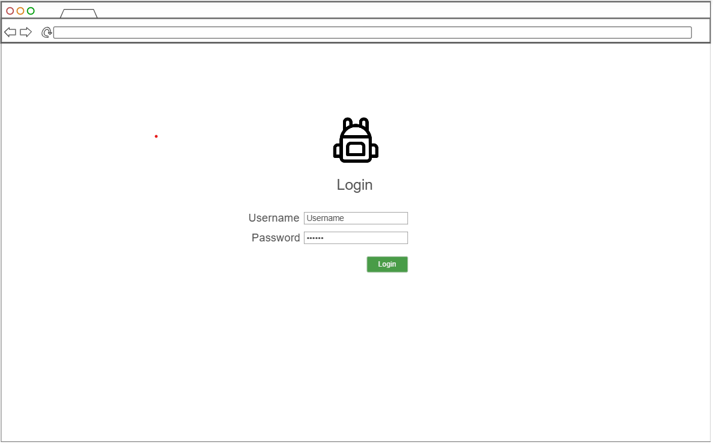

# The Bag of Holding

Welcome to The Bag of Holding!

## Elevator Pitch

The default DND character sheet is great for a lot of things, but tracking your character's inventory is not one of them. The tiny box at the bottom labeled "Equipment" will barely fit your inventory at level 1, and as you continue accumulating treasure, magic items, and tools, the problem will only get worse. *The Bag of Holding* is a great way for your whole party to keep track of the odds and ends you pick up.

## Key Features
- Create multiple characters with unique inventories
- Add and remove items from a character's inventory
- 5e SRD integration allows searching for and adding existing items

## Technologies Represented
- HTML - Three HTML pages: Login, Game+Character Select, and Inventory
- CSS - works on multiple devices with appropriate stylistic decisions
- JavaScript - menus are sortable based on user input. Users can click through the Game+Character Select menu to choose an inventory to modify. The Add Item button opens a searchable list of SRD content, with an option to create a custom item.
- React - will use the React web framework
- Service - Backend has endpoints for:
    - adding custom inventory items
    - retrieving inventory lists
    - retrieving 5e SRD items using https://www.dnd5eapi.co/api/equipment/item-name
- Authentication - users create accounts and log in. Creating a game assigns a user the role of DM, and they are given authentication to modify any inventory in that game. Non-DMs can only modify inventories of their own characters.
- Database - store users, games, characters, and lists of inventory items
- WebSocket - A DM modifying a player's inventory will send a notification to the player
    

## Sketches

### Login Screen

### Character Selection

### Inventory

